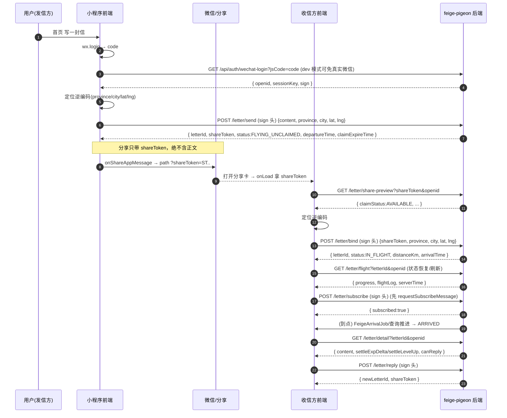

# 《飞鸽传书》独立项目 前端对接指南（V1.3 · 含测试环境路径）

> 项目 `feige-pigeon`（SpringBoot/JDK8）
> 基础地址：本地 `http://localhost:8080`；**测试环境 `http://110.40.183.197:8098`**（`dev-login` 开启，上下文 `/`）
> 配套契约：`docs/contract.md`
> 涉及：小程序注册/登录、飞鸽写信/分享/认领/飞行/拆信/回信

---

## 0. 登录（先做这一步）

前端 `wx.login()` 拿 `code`：
```js
// 登录（注册+登录一体）
GET http://localhost:8080/api/auth/wechat-login?jsCode=<code>
// → { code:200, data:{ openid, userId, sessionKey, nickname, face, sign } }
```
- 把 `openid`、`sign`、`sessionKey` 存全局（如 `app.globalData`），后续飞鸽写接口**请求头带 `sign`**。
- **dev 模式**：后端 `FG_DEV_LOGIN=true` 时，`jsCode` 直接派生出稳定 `dev_<md5>` openid，本地无需真实微信凭据。
- 更新资料：`POST /api/auth/update-profile?openid&nickname&face&mobile`

---

## 1. 飞鸽调用时序

### A. 发信方（sender）
```
首页 -> 写一封信(正文/emoji/1图)
  -> 选鸽子   GET /small-soogif/feige/pigeon/mine?openid=xx
  -> 取定位   wx.getLocation -> 前端逆地理编码(腾讯 QQMapWX) -> province/city/lat/lng
  -> 写信放飞 POST /small-soogif/feige/letter/send   (请求头 sign)
       {openid, content, imageUrl, province, city, lat, lng, pigeonId?}
       <- {letterId, shareToken, status:FLYING_UNCLAIMED, departureTime, claimExpireTime, pigeon, senderCity}
  -> 分享     onShareAppMessage 返回 path 带 shareToken（绝不带正文）
```

### B. 收信方（recipient）
```
从分享卡进入 -> onLoad 拿 shareToken
  -> GET /small-soogif/feige/letter/share-preview?shareToken=..&openid=..
       <- {claimStatus: AVAILABLE/CLAIMED_BY_ME/CLAIMED_BY_OTHER/RECALLED/EXPIRED, ...}
  -> 告诉鸽子我在哪里 → 定位逆编码
  -> POST /small-soogif/feige/letter/bind  (请求头 sign)
       {shareToken, openid, province, city, lat, lng}
       <- {letterId, status, distanceKm, flightHours, departureTime, arrivalTime, progress, firstOpenCase, waitingDurationSeconds}
  -> 飞行页(发件人/收件人都可看, 前端本地按 serverTime/progress 插值, 不强制轮询)
       GET /small-soogif/feige/letter/flight?letterId=..&openid=..   (状态恢复/刷新时调用)
  -> 订阅到达通知  wx.requestSubscribeMessage -> POST /small-soogif/feige/letter/subscribe (sign)
  -> 到点(订阅消息/自行刷新) 拆信
       GET /small-soogif/feige/letter/detail?letterId=..&openid=..
       <- {content, senderProvince, senderCity, arriveTime, flightHours, settleExpDelta/settleLevelBefore/settleLevelAfter/settleLevelUp, canReply}
  -> 回信 POST /small-soogif/feige/letter/reply (sign) -> {newLetterId, shareToken}
```

> 发件人视角确认被认领：`share-preview` 的 `claimStatus` 由 `AVAILABLE` 变为 `CLAIMED_BY_OTHER`；已认领可在 `flight` 查看进度、未认领可见 `canRecall`（≥30min 可召回）。

---

### 时序图



---

## 2. 分享：微信小程序通用机制

`onShareAppMessage`（转发好友）+ `onShareTimeline`（朋友圈），**只带 `shareToken`，绝不带正文**。

```js
Page({
  onShareAppMessage() {
    return { title: 'XXX 给你放飞了一只信鸽', path: '/pages/feige/letter?shareToken=' + this.data.shareToken };
  },
  onShareTimeline() {
    return { title: 'XXX 给你放飞了一只信鸽', query: 'shareToken=' + this.data.shareToken };
  }
});
```
- 收件方取参：`onLoad(o){ const shareToken = o.shareToken || (o.query && o.query.split('=')[1]); }`
- 开启菜单分享：`wx.showShareMenu({ menus:['shareAppMessage','shareTimeline'] })`。

---

## 3. 定位（城市级）

- `wx.getLocation({ type:'gcj02' })` 拿 `lat/lng`；`app.json` 配 `permission.scope.userLocation.desc`。
- 城市：腾讯位置服务 `QQMapWX.reverseGeocoder` 返回 `province/city`（只存/展示城市级）。
- 备选：`wx.chooseLocation()`（免授权）、`wx.getFuzzyLocation()`。
- 后端只算直线距离，不做逆地理。

---

## 4. 订阅消息（到达通知）

```js
wx.requestSubscribeMessage({ tmplIds:['<到达模板ID>'], success(){ /* 同意后调 subscribe 接口 */ } });
```
后端 `POST /letter/subscribe` 记录；到点由 `FeigeArrivalJob`/查询兜底推送（`feige.wechat.arrival-template-id` 配置了才推）。已抵达时该接口返回 `subscribed:false`（无需订阅）。

---

## 5. 前端注意事项

1. **分享绝不透传正文/精确坐标**，公开参数用 `shareToken`。
2. **写操作请求头带 `sign`** = 登录返回的 `sign`（`md5(openid+sign-secret)`）。
3. `bind` 只成功一次：首个定位者成为收件人；未到点 `detail` 返回 `NOT_ARRIVED`。
4. 拆信才见正文；`detail` 返回抵达阶段结算快照（`settleLevelUp` 等）。
5. 时间 `yyyy-MM-dd HH:mm:ss`（GMT+8）；飞行进度前端按 `serverTime`+`progress` 插值。
6. dev 登录：`FG_DEV_LOGIN=true` 后端免真实微信凭据。

---

## 6. 最小调用清单

| 时机 | 接口 | 关键入参 | sign 头 |
|---|---|---|---|
| 登录 | `GET /api/auth/wechat-login` | jsCode | 否 |
| 更新资料 | `POST /api/auth/update-profile` | openid, nickname, face, mobile | 否 |
| 进入首页 | `GET /small-soogif/feige/pigeon/mine` | openid | 否 |
| 写信 | `POST /small-soogif/feige/letter/send` | openid, content, imageUrl?, province, city, lat, lng | 是 |
| 分享 | （前端 onShareAppMessage/onShareTimeline） | shareToken | — |
| 分享预览 | `GET /small-soogif/feige/letter/share-preview` | shareToken, openid | 否 |
| 收件人认领 | `POST /small-soogif/feige/letter/bind` | shareToken, openid, province, city, lat, lng | 是 |
| 飞行页 | `GET /small-soogif/feige/letter/flight` | letterId, openid | 否 |
| 订阅通知 | `requestSubscribeMessage` + `POST /letter/subscribe` | openid, letterId | 是 |
| 拆信 | `GET /small-soogif/feige/letter/detail` | letterId, openid | 否 |
| 回信 | `POST /small-soogif/feige/letter/reply` | openid, content, imageUrl?, province, city, lat, lng, letterId | 是 |
